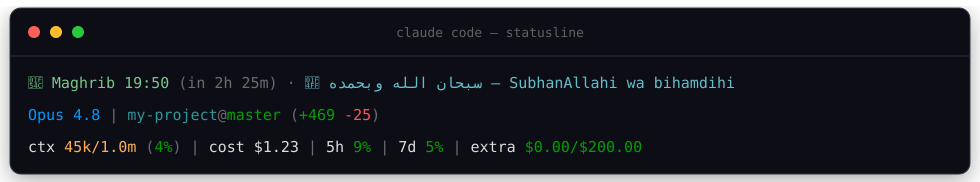

# ☪️ muslim-statusline

<p align="center">
  
</p>

Prayer times and dhikr stacked on a usage statusline (context, cost, plan limits) for Claude Code — one script, three lines.

<sub>Hijri date sits between the prayer and the dhikr by default; hidden above via `MS_NO_HIJRI=1`.</sub>

## What it does

**Line 1 — faith:**

- **Next prayer with countdown** — and for 20 minutes after the adhan: `🤲 Asr time — go pray`
- **Jumu'ah** — Friday's Dhuhr is labeled `Jumu'ah 🕌`
- **Ramadan mode** — automatic during the hijri month: iftar countdown through the day, suhoor deadline before Fajr
- **Hijri date** (hide with `MS_NO_HIJRI=1`)
- **Dhikr** — rotates every 30 minutes through 10 adhkar (Arabic + transliteration)
- Works offline once cached: location is fetched weekly ([ip-api.com](http://ip-api.com)), prayer times once per day ([Aladhan API](https://aladhan.com/prayer-times-api)). No API keys. If the network is down, dhikr still shows.
- All fetches run detached in the background — a render never waits on the network, so Claude Code can't cancel it mid-fetch and blank the line. Fresh data appears on the next render.

**Lines 2–3 — usage:** model · repo@branch with diff stats, then context window, session cost, and your 5h / 7d / extra-usage limits (cached 60s from the Claude OAuth usage API). This half is adapted from [claude-code-statusline](https://github.com/aleksander-dytko/claude-code-statusline) by Aleksander Dytko (MIT) and folded into the same script. Set `STATUSLINE_SHOW_*=false` to hide any segment — see the env list at the top of `statusline.ts`.

## Install

```bash
git clone https://github.com/Sokanon/muslim-statusline.git
cd muslim-statusline
bash install.sh
```

Or tell Claude Code: *"Clone https://github.com/Sokanon/muslim-statusline and run its install.sh"*

The installer drops a single self-contained script into `~/.claude/statuslines/` (`muslim.ts` when [Bun](https://bun.sh) is installed, `muslim.sh` otherwise) and points your statusline at it. It backs up anything it would replace first — your `settings.json` and whatever statusline script you currently run — to timestamped `.bak-<date>` files, so you can always restore.

Requirements: [Bun](https://bun.sh) (`curl -fsSL https://bun.sh/install | bash`, or `irm bun.sh/install.ps1 | iex` on Windows). Without Bun the installer falls back to the bash script on macOS and Linux, which needs `jq` and `curl` and works with either GNU or BSD date.

On Windows, run the installer from Git Bash, and Bun is required rather than optional. Claude Code hard-kills a statusline render the moment the next update arrives, and Git Bash is an MSYS process that forks for every `jq`, `date` and `git` call. A fork caught by that kill aborts inside `msys-2.0.dll` and leaves a `bash.exe.stackdump` in whatever project you had open. `statusline.ts` runs as one native process and never forks, so there is nothing to catch.

## Configuration (optional)

Set these in the `env` block of `~/.claude/settings.json` (or export them):

| Variable | Default | Notes |
|---|---|---|
| `PRAYER_METHOD` | `3` (Muslim World League) | `5` = Egyptian (fits North Africa), `4` = Umm al-Qura, `2` = ISNA — [full list](https://aladhan.com/calculation-methods) |
| `PRAYER_LAT` / `PRAYER_LON` | auto via IP | set if IP geolocation is off (VPN, datacenter IP) |
| `PRAYER_CITY` | auto via IP | display name only |
| `MS_NO_HIJRI` | unset | set to `1` to hide the hijri date (Ramadan detection still works) |

Note: countdowns use your machine's clock, so your system timezone should match your physical location. If you're on a VPN, set `PRAYER_LAT`/`PRAYER_LON` manually.

## Composing with an existing statusline

Already have a statusline you like? `MS_LINE_ONLY=1` outputs just one line (prayer · hijri · dhikr) so you can stack it on top of yours:

```bash
#!/usr/bin/env bash
input=$(cat)
prayer=$(printf '%s' "$input" | MS_LINE_ONLY=1 bun ~/.claude/statuslines/muslim.ts)
base=$(printf '%s' "$input" | bash ~/.claude/your-statusline.sh)
printf '%s\n%s' "$prayer" "$base"
```

## Cache

Lives in `~/.cache/muslim-statusline/`. Delete it to force a refresh (e.g. after traveling).
